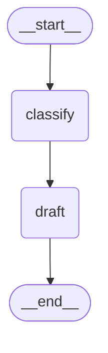

# Chapter 2 — Your first graph

This chapter builds a working graph from an empty file. It assumes you have run
`scripts/verify.py` from Chapter 1 and that it passed. No API key is needed; no model is
called.

## The three things you always write

Every LangGraph program has the same three parts, in the same order.

1. **A state schema** — what data flows through.
2. **Node functions** — the work.
3. **A graph** — how the nodes connect, then `.compile()`.

Here is all three, complete and runnable. Put it in a file and run it.

```python
from typing_extensions import TypedDict
from langgraph.graph import StateGraph, START, END

# 1. the state
class State(TypedDict):
    body: str
    category: str

# 2. a node
def classify(state: State) -> dict:
    return {"category": "billing" if "refund" in state["body"] else "unknown"}

# 3. the graph
graph = (
    StateGraph(State)
    .add_node("classify", classify)
    .add_edge(START, "classify")
    .add_edge("classify", END)
    .compile()
)

print(graph.invoke({"body": "I want a refund"}))
```

```
{'body': 'I want a refund', 'category': 'billing'}
```

That is a complete LangGraph application. The rest of this book is that shape with more in
it.

## Reading it line by line

**`class State(TypedDict)`** declares the fields that exist. `TypedDict` is a plain
annotation — at runtime this is an ordinary dict, and LangGraph reads the annotations to
learn the field names. It does *not* validate types (Chapter 23 covers using Pydantic when
you want it to).

**`def classify(state) -> dict`** is the node. Two rules govern every node you will ever
write, and both are worth stating explicitly because breaking them is the most common
beginner error:

> A node receives the **whole** state, and returns **only the fields it changed**.

`classify` reads `state["body"]` and returns just `{"category": ...}`. It says nothing
about `body`, so `body` is left alone. You never return the whole state, and you never
modify the state you were given:

```python
def wrong(state):
    state["category"] = "billing"   # mutating the input
    return state                    # returning everything

def right(state):
    return {"category": "billing"}  # just the change
```

The mutating version appears to work in simple graphs and then produces genuinely baffling
behaviour once checkpointing or parallelism is involved, because LangGraph tracks *writes*,
not mutations. Chapter 19 shows exactly how it fails.

**`START` and `END`** are sentinel values, not nodes you write. `add_edge(START, "classify")`
means "begin here". `add_edge("classify", END)` means "after this, stop".

**`.compile()`** turns the builder into something runnable and validates the structure.
Before compiling you have a blueprint; after, an executable.

**`.invoke(...)`** runs it and returns the final state — the whole state, not just what the
last node returned.

## The chained style

Every `add_*` method returns the builder, so calls chain. Both of these are identical:

```python
builder = StateGraph(State)
builder.add_node("classify", classify)
builder.add_edge(START, "classify")
graph = builder.compile()
```

```python
graph = StateGraph(State).add_node("classify", classify).add_edge(START, "classify").compile()
```

This book uses the chained form because it keeps a graph's shape visible in one glance. Use
whichever you prefer; the step-by-step form is easier to build conditionally in a loop.

## Four errors you will hit this week

These are not hypothetical. Each is printed from an actual run.

**Forgetting `.compile()`:**

```
AttributeError: 'StateGraph' object has no attribute 'invoke'
```

You are holding a blueprint, not a program. Add `.compile()`.

**Forgetting the entry point:**

```
ValueError: Graph must have an entrypoint: add at least one edge from START to another node
```

A graph with nodes but no `START` edge has nowhere to begin. This one is caught at compile
time, which is a kindness.

**Returning something that is not a dict:**

```
InvalidUpdateError: Expected dict, got oops
For troubleshooting, visit: https://docs.langchain.com/oss/python/langgraph/errors/INVALID_GRAPH_NODE_RETURN_VALUE
```

Note the URL. LangGraph's errors carry documentation links, and they are worth following.

**Mistyping a key name — and this one does not raise at all.** A node returning a field
that is not in the schema is silently ignored:

```python
class State(TypedDict):
    category: str

# "catgory" — one letter missing
graph = StateGraph(State).add_node("classify", lambda s: {"catgory": "billing"})...
```

```
result of a typo'd key: {'category': 'unset'}
-> no error, no warning; the write vanished
```

**There is no warning.** The write is dropped and the graph reports success. If a node
"has no effect", check the spelling of the key it returns before you check anything else.
Chapter 24 shows a test that catches this class of bug automatically.

## Adding a second node

Nodes connect by naming them in an edge. Add a `draft` node that uses what `classify`
produced:

```python
def draft(state: TicketState) -> dict:
    evidence = " ".join(state.get("evidence", [])) or "no supporting article"
    return {
        "draft": f"Thanks for reporting {state['ticket_id']}. {evidence}",
        "trail": ["draft"],
    }

graph = (
    StateGraph(TicketState)
    .add_node("classify", classify)
    .add_node("draft", draft)
    .add_edge(START, "classify")
    .add_edge("classify", "draft")     # the new edge
    .add_edge("draft", END)
    .compile()
)
```

This is `build_linear()` in [`examples/triage/graph.py`](../examples/triage/graph.py).

`draft` reads `state['ticket_id']`, which `classify` never set — it came in with the input.
This is the point of shared state: **a node can read anything any earlier node wrote, plus
the original input, without anyone passing it along.** Nodes never call each other and
never return values to each other. They only read and write state.

Run it:

```
{'ticket_id': 'T-1001', 'body': 'I need a refund, billing issue', 'messages': [],
 'category': 'billing', 'confidence': 0.9,
 'draft': 'Thanks for reporting T-1001. no supporting article',
 'trail': ['classify', 'draft'], 'evidence': []}
```

Every field, not just the changed ones. Note `trail: ['classify', 'draft']` — both nodes
appended to it rather than overwriting. That is a **reducer**, and it is Chapter 3.

## Seeing the shape

A compiled graph can draw itself:

```python
print(graph.get_graph().draw_mermaid())
```



GitHub renders that automatically. This is a real debugging tool, not a toy: when a graph
misbehaves, drawing it frequently shows an edge you did not mean to add. Chapter 17 uses it
that way.

## Try it

Run the linear graph and watch a field flow between nodes:

```bash
uv run python -c "from examples.triage.graph import build_linear; print(build_linear().invoke({'ticket_id':'T-1001','body':'refund please'})['trail'])"
```

Now break it on purpose — this is the fastest way to make the error messages familiar.
Remove `.compile()`, then remove the `START` edge, then misspell a key in a node's return
dict. Confirm that the third one fails **silently**.

Draw the routed version, which has a branch in it:

```bash
uv run python -c "from examples.triage.graph import build_routed; print(build_routed().get_graph().draw_mermaid())"
```

The dotted lines are conditional edges — Chapter 6.

## Takeaways

- Every graph is three parts: a state schema, node functions, and the wiring, then `.compile()`.
- A node takes the **whole state** and returns **only the fields it changed**. Never mutate
  the input; never return the whole state.
- `START` and `END` are sentinels marking entry and exit, not nodes you write.
- `.invoke()` returns the complete final state, not just the last node's output.
- Nodes never call each other. They communicate only by reading and writing shared state.
- A returned key that is not in the schema is **dropped silently, with no warning**. Suspect
  a typo first when a node seems to do nothing.
- `graph.get_graph().draw_mermaid()` renders the real structure and is a genuine debugging tool.

---

Previous: [Chapter 1 — Why LangGraph](01-why-langgraph.md) ·
Next: [Chapter 3 — State and reducers](03-state-and-reducers.md)
