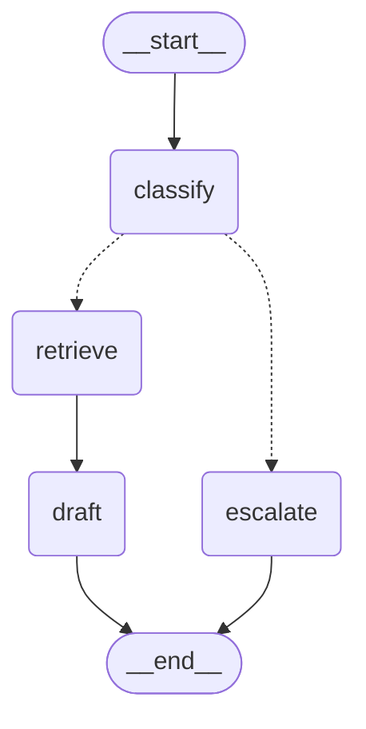

# Chapter 6 — Edges and routing

Nodes do the work. Edges decide what happens next, and that decision is where a graph stops
being a script.

There are three mechanisms. Learn all three, then use the simplest one that fits.

## Static edges

`add_edge(a, b)` means "after `a`, run `b`". Always. No condition.

```python
.add_edge(START, "classify")
.add_edge("classify", "retrieve")
.add_edge("retrieve", "draft")
.add_edge("draft", END)
```

Most edges in most graphs are static, and that is healthy. A graph where every edge is
conditional is a graph nobody can reason about.

Two static edges from the same node do **not** mean "pick one" — they mean both, in
parallel:

```python
.add_edge("classify", "retrieve")
.add_edge("classify", "notify")     # both run, together
```

That is Chapter 7. If you meant "one or the other", you want a conditional edge.

## Conditional edges

`add_conditional_edges` takes a node, a **router function**, and the list of destinations it
may return. The router receives state and returns a node name — it does not do work and does
not update state.

```python
def route(state: TicketState) -> Literal["retrieve", "escalate"]:
    return "retrieve" if state["confidence"] >= 0.5 else "escalate"

.add_conditional_edges("classify", route, ["retrieve", "escalate"])
```

Read it as: after `classify`, call `route`, and go where it says.

```
'billing refund please'   ['classify', 'retrieve', 'draft']  escalated=False
'my toaster is sentient'  ['classify', 'escalate']           escalated=True
```

Two runs, two paths, one graph.

**Return `END` to stop:**

```python
def should_continue(state) -> Literal["tools", "__end__"]:
    return "tools" if state["messages"][-1].tool_calls else END
```

**The third argument is not optional in practice**, and the reason is stronger than
documentation. Compare a router with a typo — `"retrive"` — in both forms.

With the destination list, it fails loudly:

```
RAISED: KeyError: 'retrive'
```

Without it, the same typo produces a **successful run that silently skipped the node**:

```
Task a with path ('__pregel_pull', 'a') wrote to unknown channel branch:to:retrive, ignoring it.
RESULT: {'x': 1}
```

A warning on stderr, exit code 0, and `retrieve` never ran. In a server that warning goes to
a log nobody reads, and the graph appears to work. **Always pass the destination list** — it
converts a silent skip into an exception. It also lets `draw_mermaid()` draw the branches.

Note too that a router typo survives compilation either way. This is the argument for the
`Literal[...]` return annotation: a type checker catches it before you run.

Routers can also return a **list** of node names, which fans out to all of them.

## `Command`: update and route together

Sometimes a node computes something *and* the routing decision falls out of the same work.
Splitting that across a node and a router means computing it twice or stashing an
intermediate in state purely to pass it along.

`Command` does both in one return:

```python
def review(state) -> Command[Literal["draft", "__end__"]]:
    decision = interrupt({"draft": state["draft"]})
    if decision == "approve":
        return Command(update={"trail": ["approved"]}, goto=END)
    return Command(update={"draft": decision, "trail": ["edited"]}, goto=END)
```

`update` is exactly what you would otherwise return; `goto` is where to go. The
`Command[Literal[...]]` annotation declares the destinations — it is how LangGraph learns
the edges, since there is no `add_conditional_edges` call to tell it.

### The trap: `Command` does not replace static edges

This costs people an afternoon. A node returning `Command(goto="c")` that *also* has a
static edge to `b` runs **both**:

```python
def a(state) -> Command[Literal["c"]]:
    return Command(update={"log": ["a"]}, goto="c")

.add_edge("a", "b")      # still there
```

```
{'log': ['a', 'b', 'c']}
```

`b` and `c` both ran. `goto` **adds** a dynamic edge; it does not override the static one.
If you convert a node to return `Command`, delete its outgoing `add_edge` calls.

## Choosing between them

| Situation | Use |
|---|---|
| Always the same next node | `add_edge` |
| Branch on state a previous node wrote | `add_conditional_edges` |
| The node computing the decision is the one making it | `Command` |
| Fan out to a dynamic number of parallel tasks | `Send` (Chapter 7) |

The default should be `add_conditional_edges`. It keeps routing logic in a small named
function you can unit-test with a dict, and it keeps the graph's shape declared in the
builder where you can read it.

Reach for `Command` when the alternative is putting a value into state whose only purpose is
to be read by a router one step later. That intermediate field is a smell, and `Command`
removes it.

## Routers are testable

A router is a pure function of state, so it needs no graph:

```python
def test_low_confidence_escalates():
    assert route({"confidence": 0.2}) == "escalate"
    assert route({"confidence": 0.9}) == "retrieve"
```

Every branch of your control flow can be covered this way, quickly and without a model.
Chapter 24 makes this the backbone of a test strategy.

## Seeing the branches

Conditional edges render as dotted lines:



Solid is unconditional, dotted is a choice. If a branch you expect is missing from this
diagram, you forgot the third argument to `add_conditional_edges`.

## Try it

Drive both paths through the same graph:

```bash
uv run python -c "
from examples.triage.graph import build_routed
g = build_routed()
for body in ['billing refund please', 'my toaster is sentient']:
    out = g.invoke({'ticket_id':'T-1001','body':body})
    print(f'{body!r:28} {out[\"trail\"]}')
"
```

Now prove the `Command` trap on your own machine — this is the one to have felt once:

```bash
uv run python -c "
import operator
from typing import Annotated, Literal
from typing_extensions import TypedDict
from langgraph.graph import StateGraph, START, END
from langgraph.types import Command

class C(TypedDict): log: Annotated[list, operator.add]
def a(state) -> Command[Literal['c']]:
    return Command(update={'log':['a']}, goto='c')

g = (StateGraph(C).add_node('a',a)
     .add_node('b', lambda s:{'log':['b']}).add_node('c', lambda s:{'log':['c']})
     .add_edge(START,'a').add_edge('a','b')
     .add_edge('b',END).add_edge('c',END).compile())
print(g.invoke({'log': []}))
"
```

You asked for `c`. You got `b` and `c`. Delete the `.add_edge('a','b')` and run again.

## Takeaways

- Three mechanisms: `add_edge` (always), `add_conditional_edges` (branch), `Command`
  (update and branch together).
- Two static edges from one node run **both, in parallel** — not one or the other.
- A router is a pure function returning a node name or `END`. It routes; it never updates state.
- **Always pass the destination list to `add_conditional_edges`.** Without it, a router typo
  logs a warning, skips the node, and the run still succeeds. With it, you get a `KeyError`.
- A typo in a router survives compilation either way. Annotate with `Literal[...]` so a type
  checker catches it first.
- **`Command(goto=...)` adds an edge; it does not replace static ones.** Remove the node's
  `add_edge` calls or both destinations run.
- Prefer `add_conditional_edges` by default; use `Command` to avoid a state field that
  exists only to be read by a router.
- Routers test with a plain dict and no graph. Cover every branch that way.

---

Previous: [Chapter 5 — Nodes](05-nodes.md) ·
Next: [Chapter 7 — Parallelism and `Send`](07-parallelism-and-send.md)
